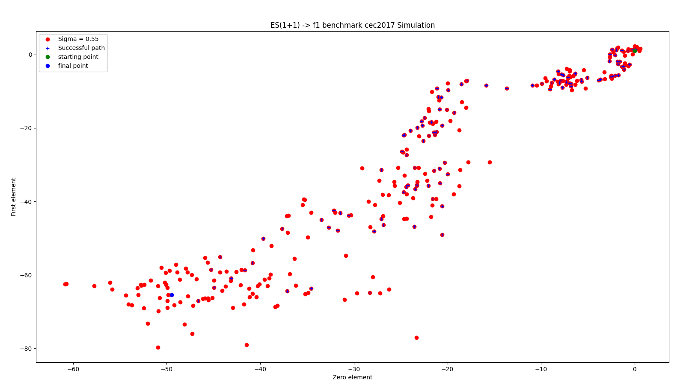
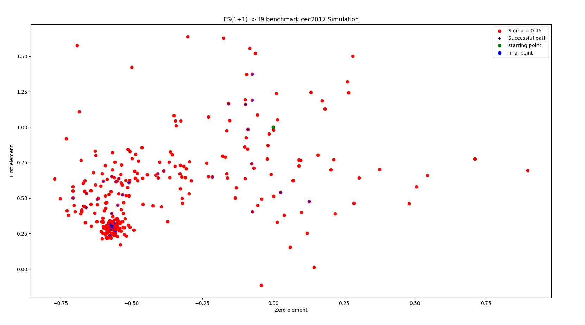
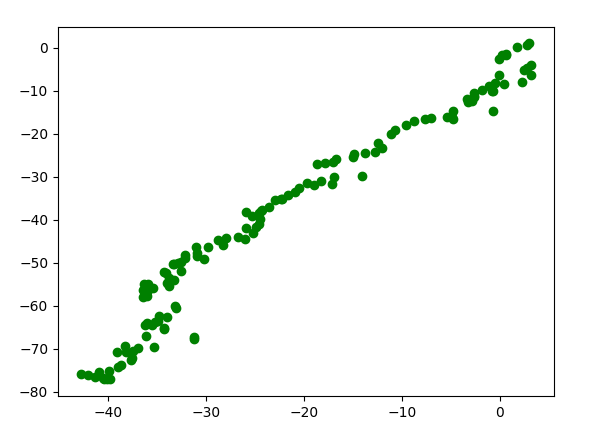

# Evolutionary algorithms

* evolutionary strategy - elite succesion, tournament reproduction and two-point crossover.

* one plus one strategy - with possible interval change of 1/5 rule.

## Table of contents
* [General info](#general-info)
* [Technologies](#technologies)
* [Results](#results)
* [Setup](#setup)

## General info
Those are implementations of two most popular stategies in Python.

Algorithms were tested on [cec2017](https://github.com/tilleyd/cec2017-py) benchmark.

File `evolutionary_strategy,py` contains ES algorithm body with splited hyperparameters class.

File `oneplusone.py` contains 1+1 algorithm implementations.

Files `ES_examples.py` and `oneplusone_examples.py` are used for testing algorithms.
	
## Technologies
Projects are created with libraries:
* random
* copy
* dataclasses

and tested with:
* matplotlib
* numpy

## Results
### 1 + 1

## # Evolutionary strategy

## Setup
Both of option can be simply tested by runing either `ES_examples.py` or `oneplusone_examples.py` files. Those files can be change to adjust hyperparameters such as sigma or interval.